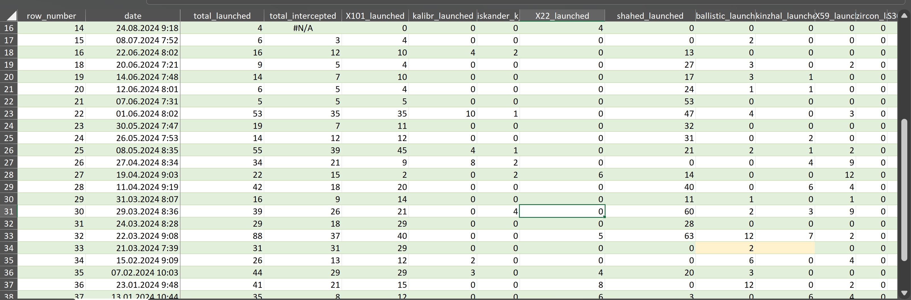

# 2024-Ukraine-massive-shelling-analysis
Аналіз масованих обстрілів території України із залученням стратегічної авіації. Дані зібрано на основі повідомлень офіційного Telegram-каналу Повітряних сил України https://t.me/kpszsu

> [!IMPORTANT]
> Я не маю прямого стосунку до військової сфери й не володію професійною експертизою в цій темі. Тому в класифікаціях і висновках можуть бути певні неточності. Це дослідження виконане виключно з особистого громадянського інтересу.
> 
> Інформація в цьому дослідженні ґрунтується на звітах Повітряних сил України, опублікованих після кожної масованої атаки. З огляду на безперервні російські удари із застосуванням різних видів озброєння, ці звіти не завжди можуть давати повну вичерпну картину. Наприклад, у них можуть бути відсутні дані про керовані авіаційні бомби або окремі типи безпілотних літальних апаратів.

> [!NOTE]
> Мої Tableau дашборди опубліковані тут [Tableau Public](https://public.tableau.com/app/profile/anastasia.zinovets/viz/Russianmassmissileanddroneattacks/Story1)

## Data preparation

Джерело: https://t.me/kpszsu

Основні файли: 
- [Необроблені дані](/data/Shelling_raw_data.csv) → [Оброблпені дані](/data/Shelling_data_final.xlsx)
- [Python Notebook](Massive_shelling_data_extraction.ipynb)

Дані були зібрані у вигляді текстових повідомлень із офіційного телеграм каналу Повітряних Сил України, відфільтровані за датою та наявністю згадування стратегічної авіації: ТУ-95/ТУ-95мс, ТУ-22/Ту22М. Тобто цей аналіз вкючає лище атаки із застосуванням стратегічної авіації РФ.

У Excel, із цих повідомлень були сформовані колонки, що відровідають різним типам запущених/перехоплених видів озброєнь.

Screenshot з Excel-файлу 

Деякі види озброєнь були інколи об'єднані у звітах Повітряних Сил - щоб зберегди достовірність такі види було проаналізовано разом. У Excel-файлі такі дані підписано. Приклад озброєнь, що об'єднувались: збиття балвстичних ракет та ракет "Кинджал", крилаті ракети "Калібр" та крилаті ракети X-101/X-555/Х-55.

Screenshot з Excel-файлу 

